# Release Process

This repository has three independent release pipelines: **service** (API + runner), **sandbox** (sandbox image), and **SDK**.

```mermaid
flowchart TD
    subgraph alpha ["Alpha (every push to main)"]
        A[Push to main] --> B[release-alpha]
        B --> C[Build multi-arch images]
        C --> D[Push to GHCR\napi / runner-dind / sandbox\n:alpha + :sha]
    end

    subgraph versioned ["Versioned Release (service or sandbox)"]
        E[Manual: Run Release Prep] --> F[Bump version file\nCreate release branch + PR]
        F --> G[Release Validate CI]
        G --> H{Merge PR}
        H --> I[Run tests]
        I --> J[Build + push multi-arch\nimages to Docker Hub]
        J --> K[Create git tag +\nGitHub Release]
        K --> L[Open post-release\nversion-bump PR to main]
    end

    subgraph sdk ["SDK Release"]
        M[Manual: Run SDK Release Prep] --> N[Bump sdk/package.json\nCreate release branch + PR]
        N --> O{Merge PR}
        O --> P[Build + publish\nto npm]
        P --> Q[Create git tag +\nGitHub Release]
        Q --> R[Open post-release\nversion-bump PR to main]
    end
```

## Alpha Releases (GHCR)

On every push to `main`, the `release-alpha` workflow builds and pushes all three multi-arch images (`linux/amd64`, `linux/arm64`) to GHCR:

- `ghcr.io/n8n-io/n8n-sandbox-service-api:alpha`
- `ghcr.io/n8n-io/n8n-sandbox-service-runner-dind:alpha`
- `ghcr.io/n8n-io/n8n-sandbox-service-sandbox:alpha`

Each image is also tagged with the full commit SHA.

## Service Release (Docker Hub)

Publishes the API and runner images to Docker Hub. Version tracked in `SERVICE_VERSION`.

**Images:**
- `n8nio/n8n-sandbox-service-api`
- `n8nio/n8n-sandbox-service-runner-dind`

**Tags:** `{version}`, `latest`, `stable`

### Steps

1. Go to **Actions → Service Release Prep** and run the workflow, choosing `patch`, `minor`, or `major`.
2. The workflow bumps `SERVICE_VERSION`, creates a release branch (`service/release/{version}`), and opens a PR.
3. The `Service Release Validate` workflow runs CI on the PR.
4. Merge the PR. This triggers the `Service Publish` workflow, which:
   - Runs tests
   - Builds and pushes multi-arch images to Docker Hub
   - Creates a git tag (`service/v{version}`) and GitHub Release
   - Opens a post-release PR to sync `SERVICE_VERSION` back to `main`
5. Merge the post-release PR.

## Sandbox Release (Docker Hub)

Publishes the sandbox image to Docker Hub. Version tracked in `SANDBOX_VERSION`.

**Image:** `n8nio/n8n-sandbox-service-sandbox`

**Tags:** `{version}`, `latest`

### Steps

1. Go to **Actions → Sandbox Release Prep** and run the workflow, choosing `patch`, `minor`, or `major`.
2. The workflow bumps `SANDBOX_VERSION`, creates a release branch (`sandbox/release/{version}`), and opens a PR.
3. The `Sandbox Release Validate` workflow runs CI on the PR.
4. Merge the PR. This triggers the `Sandbox Publish` workflow, which:
   - Runs tests
   - Builds and pushes multi-arch images to Docker Hub
   - Creates a git tag (`sandbox/v{version}`) and GitHub Release
   - Opens a post-release PR to sync `SANDBOX_VERSION` back to `main`
5. Merge the post-release PR.

## SDK Release (npm)

Publishes `@n8n/sandbox-client` to npm. Version tracked in `sdk/package.json`.

### Steps

1. Go to **Actions → SDK Release Prep** and run the workflow, choosing `patch`, `minor`, or `major`.
2. Merge the release PR. This triggers the `SDK Publish` workflow, which publishes to npm, creates a git tag (`sdk/v{version}`) and GitHub Release, and opens a post-release PR.
3. Merge the post-release PR.

## Git Tag Namespaces

- Service: `service/v{version}` (e.g. `service/v1.0.0`)
- Sandbox: `sandbox/v{version}` (e.g. `sandbox/v1.0.0`)
- SDK: `sdk/v{version}` (e.g. `sdk/v0.0.4`)
