# Release Process

This repository has three independent release pipelines: service (API + runner), sandbox (sandbox image), and SDK.

```mermaid
flowchart TD
    subgraph alpha ["Alpha (every push to main)"]
        A[Push to main] --> B[release-alpha]
        B --> C[Build multi-arch images]
        C --> D[Push to private registry\napi / runner-dind / runner-firecracker / sandbox\n:alpha + :sha]
    end

    subgraph versioned ["Versioned Release (service or sandbox)"]
        E[Manual: Run Release Prep] --> F[Bump version file\nCreate release branch + PR]
        F --> G[Release Validate CI]
        G --> H{Merge PR}
        H --> I[Run tests]
        I --> J[Build + push multi-arch\nimages to Docker Hub]
        J --> K[Create git tag +\nGitHub Release +\ngolden-build tarball]
        K --> L[Open post-release\nversion-bump PR to main]
    end

    subgraph sdk ["SDK Release"]
        M[Manual: Run SDK Release Prep] --> N[Bump sdk/package.json\nCreate release branch + PR]
        N --> O{Merge PR}
        O --> P[Build + publish\nto npm]
        P --> Q[Create git tag +\nGitHub Release]
        Q --> R[Open post-release\nversion-bump PR to main]
    end
```



## Alpha Releases

On every push to `main`, the `release-alpha` workflow builds and pushes the alpha images to the private container registry:

- `n8n-sandbox-service-api:alpha`
- `n8n-sandbox-service-runner-dind:alpha`
- `n8n-sandbox-service-runner-firecracker:alpha`
- `n8n-sandbox-service-sandbox:alpha`

Each image is also tagged with the full commit SHA.

The Firecracker runner alpha image is published for `linux/amd64` only.

## Service Release (Docker Hub)

Publishes the API and runner images to Docker Hub. Version tracked in `SERVICE_VERSION`.

**Images:**
- `n8nio/n8n-sandbox-service-api`
- `n8nio/n8n-sandbox-service-runner-dind`

**Tags:** `{version}`, `latest`, `stable`

### Steps

1. Go to **Actions → Service Release Prep** and run the workflow, choosing `patch`, `minor`, or `major`.
2. The workflow bumps `SERVICE_VERSION`, creates a release branch (`service/release/{version}`), and opens a PR.
3. The `Service Release Validate` workflow runs CI on the PR.
4. Merge the PR. This triggers the `Service Publish` workflow, which:
   - Runs tests
   - Builds and pushes multi-arch images to Docker Hub
   - Packages `firecracker-golden-build-{version}.tar.gz` and attaches it to the release
   - Creates a git tag (`service/v{version}`) and GitHub Release
   - Opens a post-release PR to sync `SERVICE_VERSION` back to `main`
5. Merge the post-release PR.

### Firecracker golden build asset

Each service release (and staging prerelease) includes
`firecracker-golden-build-{version}.tar.gz` on the GitHub Release. The tarball
contains `create-golden-snapshot.sh`, `setup-firecracker-e2e-vm.sh`, and a
`MANIFEST.json` with pinned versions.

Package locally:

```bash
./scripts/package-firecracker-golden-build.sh --version "$(tr -d '[:space:]' < SERVICE_VERSION)"
```

#### Copy-on-release contract

Deployments should consume golden-build scripts only from the release
tarball for the exact service version they deploy — never a separate copy. This
keeps a single source of truth so the snapshot scripts and the runner binary
can't drift apart.

Deploy sequence (per environment):

1. Download and unpack `firecracker-golden-build-{version}.tar.gz`; read `MANIFEST.json`.
2. Assert the golden build and the runner image you deploy came from the same
   commit: compare `git_sha` in `MANIFEST.json` against the runner image's SHA
   tag (every image is tagged with its full commit SHA).
3. Rebuild the golden snapshot on every runner VM (`setup-firecracker-e2e-vm.sh`
   or `create-golden-snapshot.sh` from the tarball).
4. Roll the `runner-firecracker` image to `{version}` — after step 3, never before.
5. Roll the API and dind images to `{version}`.
6. Gate the rollout on `SMOKE_ENV={env} ./scripts/smoke-sandbox.sh`.

## Staging candidates (pre-merge)

Use **Actions → Publish Service Staging** on your feature branch before merging
to `main`. The workflow:

1. Optionally runs unit tests
2. Builds and pushes API, runner-dind, and Firecracker runner images to the
   private container registry tagged `{SERVICE_VERSION}-staging.{short_sha}`
   (override with the `version` input)
3. Creates a GitHub prerelease (`service/v{version}`) with the golden-build tarball

After deploying those image tags to staging, run:

```bash
SMOKE_ENV=stage ./scripts/smoke-sandbox.sh
```

On Firecracker runner VMs, download the prerelease tarball and rebuild the
golden snapshot before rolling out the new `runner-firecracker` image (see the
copy-on-release contract above).

## Sandbox Release (Docker Hub)

Publishes the sandbox image to Docker Hub. Version tracked in `SANDBOX_VERSION`.

**Image:** `n8nio/n8n-sandbox-service-sandbox`

**Tags:** `{version}`, `latest`

### Steps

1. Go to **Actions → Sandbox Release Prep** and run the workflow, choosing `patch`, `minor`, or `major`.
2. The workflow bumps `SANDBOX_VERSION`, creates a release branch (`sandbox/release/{version}`), and opens a PR.
3. The `Sandbox Release Validate` workflow runs CI on the PR.
4. Merge the PR. This triggers the `Sandbox Publish` workflow, which:
   - Runs tests
   - Builds and pushes multi-arch images to Docker Hub
   - Creates a git tag (`sandbox/v{version}`) and GitHub Release
   - Opens a post-release PR to sync `SANDBOX_VERSION` back to `main`
5. Merge the post-release PR.

## SDK Release (npm)

Publishes `@n8n/sandbox-client` to npm. Version tracked in `sdk/package.json`.

### Steps

1. Go to **Actions → SDK Release Prep** and run the workflow, choosing `patch`, `minor`, or `major`.
2. Merge the release PR. This triggers the `SDK Publish` workflow, which publishes to npm, creates a git tag (`sdk/v{version}`) and GitHub Release, and opens a post-release PR.
3. Merge the post-release PR.

## Git Tag Namespaces

- Service: `service/v{version}` (e.g. `service/v1.0.0`)
- Sandbox: `sandbox/v{version}` (e.g. `sandbox/v1.0.0`)
- SDK: `sdk/v{version}` (e.g. `sdk/v0.0.4`)
