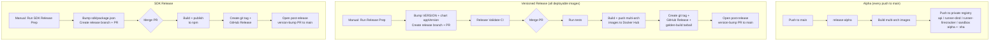

# Release Process

This repository has two release pipelines: the service release, which publishes
every deployable image under one version, and the SDK.

One version — tracked in `VERSION` and mirrored into the chart's `appVersion` —
covers the API, both runners, and the sandbox image. Those four images are built
from the same commit and are only supported together: the sandbox image embeds
`cmd/daemon`, the runners speak an internal contract to that daemon, and the
Firecracker guest rootfs is packed from the sandbox image pinned in the
golden-build bundle. The SDK is versioned independently in `sdk/package.json`
because it is a client library whose consumers do not deploy this service.

> **Migration note.** Before unification the service and sandbox trains drifted, so
> no released version has a complete image set: the sandbox image stops at `1.1.0`
> while the service went on to `1.1.1` and beyond, and `runner-firecracker:1.1.0`
> was never published. The chart's `appVersion` is therefore pinned to `1.1.0` — the
> newest version where every image the chart deploys (`api`, `runner-dind`,
> `sandbox`) exists — and deliberately lags `VERSION` until the first unified
> release, so that a default `helm install` cannot resolve a tag that was never
> pushed. Release validate only compares the two on `service/release/**` PRs, where
> `scripts/set-release-version.sh` has already written both. From the first unified
> release on they always match; delete this note then.


```mermaid
flowchart TD
    subgraph alpha ["Alpha (every push to main)"]
        A[Push to main] --> B[release-alpha]
        B --> C[Build multi-arch images]
        C --> D[Push to private registry\napi / runner-dind / runner-firecracker / sandbox\n:alpha + :sha]
    end

    subgraph versioned ["Versioned Release (all deployable images)"]
        E[Manual: Run Release Prep] --> F[Bump VERSION + chart appVersion\nCreate release branch + PR]
        F --> G[Release Validate CI]
        G --> H{Merge PR}
        H --> I[Run tests]
        I --> J[Build + push multi-arch\nimages to Docker Hub]
        J --> K[Create git tag +\nGitHub Release +\ngolden-build tarball]
        K --> L[Open post-release\nversion-bump PR to main]
    end

    subgraph sdk ["SDK Release"]
        M[Manual: Run SDK Release Prep] --> N[Bump sdk/package.json\nCreate release branch + PR]
        N --> O{Merge PR}
        O --> P[Build + publish\nto npm]
        P --> Q[Create git tag +\nGitHub Release]
        Q --> R[Open post-release\nversion-bump PR to main]
    end
```

## Alpha Releases

On every push to `main`, the `release-alpha` workflow builds and pushes the alpha images to the private container registry:

- `n8n-sandbox-service-api:alpha`
- `n8n-sandbox-service-runner-dind:alpha`
- `n8n-sandbox-service-runner-firecracker:alpha`
- `n8n-sandbox-service-sandbox:alpha`

Each image is also tagged with the full commit SHA.

The Firecracker runner alpha image is published for `linux/amd64` only.

## Service Release (Docker Hub)

Publishes every deployable image to Docker Hub under the version in `VERSION`.

Images:

- `n8nio/n8n-sandbox-service-api`
- `n8nio/n8n-sandbox-service-runner-dind`
- `n8nio/n8n-sandbox-service-runner-firecracker` (linux/amd64 only; requires KVM on the host)
- `n8nio/n8n-sandbox-service-sandbox`

Tags: `{version}`, `latest`, `stable`

Deploy the same `{version}` for all four. Mixing versions is unsupported — there is
no compatibility matrix, because the runner/daemon contract can change on any
commit.

### Steps

1. Go to Actions → Service Release Prep and run the workflow, choosing `patch`, `minor`, or `major`.
2. The workflow bumps `VERSION` and the chart's `appVersion` (via
   `scripts/set-release-version.sh`), creates a release branch
   (`service/release/{version}`), and opens a PR.
3. The `Service Release Validate` workflow runs CI on the PR and fails if `VERSION`
   and the chart `appVersion` disagree.
4. Merge the PR. This triggers the `Service Publish` workflow, which:
   - Runs tests
   - Builds and pushes multi-arch images to Docker Hub, sandbox image included
   - Packages `firecracker-golden-build-{version}.tar.gz` and attaches it to the release
   - Creates a git tag (`service/v{version}`) and GitHub Release
   - Opens a post-release PR to sync `VERSION` and the chart `appVersion` back to `main`
5. Merge the post-release PR. The chart publish workflow then ships a chart whose
   default image tags point at images that already exist.

### Firecracker golden build asset

Each service release (and staging prerelease) includes
`firecracker-golden-build-{version}.tar.gz` on the GitHub Release. The tarball
(schema v3) contains `install-runner-host.sh`, `firecracker-ci-assets.sh`,
`build-rootfs-template.sh`, `configure-host-nat.sh`, `create-golden-snapshot.sh`, a pre-built `bin/sandbox-daemon`, and a
`MANIFEST.json` with entrypoints, the pinned sandbox image (`sandbox_image`), and versions.

Schema v3 replaces the manifest's `service_version` and `sandbox_version` fields
with a single `version`, matching the one version all images now share.

Package locally:

```bash
./scripts/package-firecracker-golden-build.sh --version "$(tr -d '[:space:]' < VERSION)"
```

`sandbox_image.ref` defaults to `n8nio/n8n-sandbox-service-sandbox:{VERSION}`, so
the bundle and the sandbox image always carry the same version. Set
`SANDBOX_IMAGE_REF` to point elsewhere — a digest ref (`{repository}@sha256:...`)
for a reproducible bundle, or another registry, which is what the staging workflow
does to pin its ACR candidate. `repository` and `tag` in the manifest are derived
from whatever `ref` you pass.

#### Copy-on-release contract

Deployments should consume golden-build scripts only from the release
tarball for the exact service version they deploy — never a separate copy. This
keeps a single source of truth so the snapshot scripts and the runner binary
can't drift apart.

Deploy sequence (per environment):

1. Download and unpack `firecracker-golden-build-{version}.tar.gz`; read `MANIFEST.json`.
2. Assert the golden build and the runner image you deploy came from the same
   commit: compare `git_sha` in `MANIFEST.json` against the runner image's SHA
   tag (every image is tagged with its full commit SHA).
3. Rebuild the golden snapshot on every runner VM using the bundle entrypoints
   (`create-golden-snapshot.sh`; rootfs template is baked into the gallery image —
   rebake it first when `sandbox_image.ref` changed since the last bake)
   or the full e2e bootstrap (`setup-firecracker-e2e-vm.sh`).
4. Roll the `runner-firecracker` image to `{version}` — after step 3, never before.
5. Roll the API, dind, and sandbox images to the same `{version}`.
6. Gate the rollout on `SMOKE_ENV={env} ./scripts/smoke-sandbox.sh`.

## Staging candidates (pre-merge)

Use Actions → Publish Service Staging on your feature branch before merging
to `main`. The workflow:

1. Optionally runs unit tests
2. Builds and pushes the API, runner-dind, Firecracker runner, and sandbox images
   to the private container registry tagged `{VERSION}-staging.{short_sha}`
   (override with the `version` input)
3. Creates a GitHub prerelease (`service/v{version}`) with the golden-build tarball,
   which pins the ACR sandbox candidate by its commit-SHA tag (the `version` label is
   caller-supplied and may be reused by a later run)

After deploying those image tags to staging, run:

```bash
SMOKE_ENV=stage ./scripts/smoke-sandbox.sh
```

On Firecracker runner VMs, download the prerelease tarball and rebuild the
golden snapshot before rolling out the new `runner-firecracker` image (see the
copy-on-release contract above).

## Sandbox image

The sandbox image ships as part of the service release above; it has no separate
version or workflow. It embeds `cmd/daemon` built from the same commit, which is
why an independent version was never meaningful.

### Firecracker runners consume this image at build time, not at run time

The Firecracker guest rootfs is built from `Dockerfile.sandbox`, so a release
changes the Firecracker guest userspace too. Firecracker runners never pull the
sandbox image; they boot `rootfs.ext4`, which was packed from the image pinned as
`sandbox_image.ref` in the golden-build `MANIFEST.json`.

Shipping a new sandbox image to Firecracker hosts therefore requires a rootfs
template rebake and golden snapshot rebuild on the runner VMs. Rolling the sandbox
image tag alone only affects the Docker/sysbox runner.

## SDK Release (npm)

Publishes `@n8n/sandbox-client` to npm. Version tracked in `sdk/package.json`, and
deliberately independent of `VERSION`: it is a client library whose version
communicates HTTP API compatibility to consumers who do not deploy this service.

### Steps

1. Go to Actions → SDK Release Prep and run the workflow, choosing `patch`, `minor`, or `major`.
2. Merge the release PR. This triggers the `SDK Publish` workflow, which publishes to npm, creates a git tag (`sdk/v{version}`) and GitHub Release, and opens a post-release PR.
3. Merge the post-release PR.

## Git Tag Namespaces

- Service: `service/v{version}` (e.g. `service/v1.0.0`) — covers all four images
- SDK: `sdk/v{version}` (e.g. `sdk/v0.0.4`)

`sandbox/v{version}` tags exist for releases made before versions were unified and
are not created anymore.
