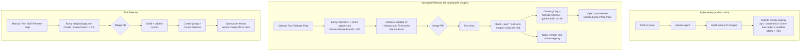

# Release Process

Two release pipelines: the service release, which publishes every deployable image under one version, and the SDK.

One version — `VERSION`, mirrored into the chart's `appVersion` — covers the API, both runners and the sandbox image. The four images are built from the same commit and only supported together: the sandbox image embeds `cmd/daemon`, the runners speak an internal contract to that daemon, and the Firecracker guest rootfs is packed from the sandbox image pinned in the golden-build bundle. The SDK is versioned independently in `sdk/package.json` because its consumers do not deploy this service.

```mermaid
flowchart TD
    subgraph alpha ["Alpha (every push to main)"]
        A[Push to main] --> B[release-alpha]
        B --> C[Build multi-arch images]
        C --> D[Push to private registry\napi / runner-dind / runner-firecracker / sandbox\n:alpha + :sha]
    end

    subgraph versioned ["Versioned Release (all deployable images)"]
        E[Manual: Run Release Prep] --> F[Bump VERSION + chart appVersion\nCreate release branch + PR]
        F --> G[Release Validate CI\n+ Sysbox and Firecracker e2e on Azure]
        G --> H{Merge PR}
        H --> I[Run tests]
        I --> J[Build + push multi-arch\nimages to Docker Hub]
        J --> K[Create git tag +\nGitHub Release +\ngolden-build tarball]
        K --> L[Open post-release\nversion-bump PR to main]
        J --> S[Copy :version into\nprivate registry]
    end

    subgraph sdk ["SDK Release"]
        M[Manual: Run SDK Release Prep] --> N[Bump sdk/package.json\nCreate release branch + PR]
        N --> O{Merge PR}
        O --> P[Build + publish\nto npm]
        P --> Q[Create git tag +\nGitHub Release]
        Q --> R[Open post-release\nversion-bump PR to main]
    end
```

## Alpha releases

Every push to `main` runs `release-alpha`, which pushes `n8n-sandbox-service-{api,runner-dind,runner-firecracker,sandbox}` to the private container registry tagged `:alpha` and `:<full_sha>`. The Firecracker runner image is `linux/amd64` only.

## Service release (Docker Hub)

Publishes to Docker Hub under the version in `VERSION`, tagged `{version}`, `latest` and `stable`:

- `n8nio/n8n-sandbox-service-api`
- `n8nio/n8n-sandbox-service-runner-dind`
- `n8nio/n8n-sandbox-service-runner-firecracker` (`linux/amd64` only; needs KVM on the host)
- `n8nio/n8n-sandbox-service-sandbox`

Deploy the same `{version}` for all four. There is no compatibility matrix; the runner/daemon contract can change on any commit.

### Steps

1. Actions → **Service Release Prep**, choosing `patch`, `minor` or `major`. The optional `version` input releases an exact `x.y.z` instead (use it to skip a number a past release burned).
2. The workflow bumps `VERSION` and the chart `appVersion` (`scripts/set-release-version.sh`), then rejects the version unless it is unused (no `service/v{version}` tag, no `service/release/{version}` branch) and strictly newer than every version already released or in flight — the highest of all `service/v*` tags and `service/release/*` branches. Releases build from the tip of `main`, so a lower number would ship newer code while moving `latest`/`stable` backwards. Staging candidates carry a suffix and do not raise the floor. It then creates `service/release/{version}` and opens a PR.

   This orders the *starts* of releases, not their merges. If two release PRs are open, merge them in ascending version order.
3. **Service Release Validate** runs CI on the PR, fails if `VERSION` and `appVersion` disagree, and runs the Sysbox and Firecracker e2e suites on Azure VMs (the same workflows the `e2e-sysbox` / `e2e-firecracker` PR labels trigger). CI on `main` only exercises the privileged-Docker lane, so this is where both shipped runners are covered. Allow about an hour; re-run a flaky lane from the validate run rather than re-prepping.
4. Merge the PR. **Service Publish** runs tests, then builds and pushes the multi-arch images to Docker Hub.

   Jobs build from the PR's merge commit and take the version from the branch name (`service/release/{version}`), cross-checked against `VERSION`, so a PR that bumps to a different number fails before anything is pushed. Publishing also aborts up front if `service/v{version}` already exists.

   Two jobs then run in parallel:
   - `mirror-to-acr` copies the images into the private registry (see below).
   - `release-metadata` packages `firecracker-golden-build-{version}.tar.gz` and attaches it to the GitHub Release, creates the `service/v{version}` tag, and opens a post-release PR syncing `VERSION` and `appVersion` back to `main`.
5. Merge the post-release PR. The chart publish workflow then ships a chart whose default image tags already exist.
6. Pin the tarball digest before baking a runner image from this version (see [Verifying the tarball](../BUNDLE.md#verifying-the-tarball)).

### Private registry mirror

`mirror-to-acr` copies all four published manifests by digest into n8n's private registry under `{version}` (`docker buildx imagetools create`; same digests as Docker Hub). An existing `{version}` is never replaced — a rebuild that produces a different manifest fails instead of swapping content behind a tag. Re-copying an identical manifest is a no-op, so the job is re-runnable.

The mirror depends only on the image publish, and `release-metadata` does not wait on it. A release can therefore end with tag, GitHub Release and Docker Hub published while the mirror is missing; the run is red until `mirror-to-acr` is re-run.

### Firecracker golden-build asset

Each service release and staging prerelease attaches `firecracker-golden-build-{version}.tar.gz`. Contents, `MANIFEST.json` fields, packaging and the rollout order for Firecracker hosts are in [BUNDLE.md](../BUNDLE.md). The rule that matters for releases: rebuild the golden snapshot on every runner VM from the bundle for the exact version you ship, roll `runner-firecracker` to that version only afterwards, then roll API, dind and sandbox to the same version, and gate on `scripts/smoke-sandbox.sh`.

## Staging candidates (pre-merge)

Actions → **Publish Service Staging** on a feature branch:

1. Optionally runs unit tests.
2. Builds and pushes all four images to the private registry tagged `{VERSION}-staging.{short_sha}` (override with the `version` input).
3. Creates a GitHub prerelease `service/v{version}` at the built commit with the golden-build tarball, which pins the ACR sandbox candidate by its commit-SHA tag.

A bare `x.y.z` `version` input is rejected: candidates and releases share the `service/v*` namespace, which release prep reads to order releases, so a candidate tagged `service/v1.3.0` would block the real 1.3.0. Keep a suffix.

A label is also single-use: prereleases are immutable, so the workflow reserves the `service/v{version}` tag before pushing any image and fails if it already exists — a run that fails later has still spent its label. Publish the same commit again under a new label, for example `1.3.5-staging.abc1234.2`.

After deploying a candidate, run `SMOKE_ENV=<env> scripts/smoke-sandbox.sh` against it (the preset file is described in [development.md](development.md#tests)). Firecracker hosts need the prerelease tarball and a snapshot rebuild before the new `runner-firecracker` image rolls out.

## Sandbox image

Ships with the service release; no separate version or workflow. Firecracker runners consume it at build time, not run time: the guest rootfs is packed from the image pinned as `sandbox_image.ref` in the bundle `MANIFEST.json`, so shipping a new sandbox image to Firecracker hosts needs a rootfs rebake and snapshot rebuild. Rolling the sandbox image tag alone only affects the Docker/sysbox runner.

## SDK release (npm)

Publishes `@n8n/sandbox-client`. Version in `sdk/package.json`, independent of `VERSION`.

1. Actions → **SDK Release Prep**, choosing `patch`, `minor` or `major`.
2. Merge the release PR. **SDK Publish** publishes to npm, creates the `sdk/v{version}` tag and GitHub Release, and opens a post-release PR.
3. Merge the post-release PR.

## Git tag namespaces

- Service: `service/v{version}` — covers all four images
- SDK: `sdk/v{version}`

Release tags are immutable. Both are created unforced with the release GitHub App's token, so a tag always points at the commit its images and assets were built from, which is what makes the `git_sha` check in [BUNDLE.md](../BUNDLE.md) meaningful. A tag ruleset on `service/v*` and `sdk/v*` blocks moving and deleting them and only lets the app create them, and release immutability is enabled on the repository: a published release or prerelease keeps its assets and tag for good, and its tag name can never be reused, so the tarball is attached in the `gh release create` call itself. Releases made before the setting was enabled stay mutable. `sandbox/v{version}` tags predate version unification and are no longer created.
